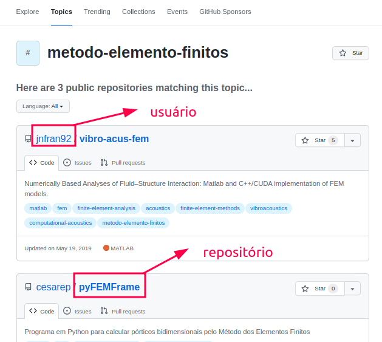

<h1>Como funciona a plataforma</h1>

<p align = "justify">
Podemos dizer que o Git irá permitir que você separe o código em quatro espaços distintos e controlados conforme a <a href = "#fig11">Figura 1.1</a>.  
</p>

<p align = "left" id = "fig11"><b>Figura 1.1</b> Representação dos espaços do Git.</p>
<center></center>

<p align = "justify">
A seção <i>workspace</i> estará localizado no  nosso próprio computador e será a pasta onde o Git utilizará suas ferramentas de controle.
<br><br>
A "estação" <i>staging</i> é aquele espaço destinado aos arquivos que vão para nova versão do código-fonte.
<br><br>
O <i>local repository</i> é o espaço local que estará com todas as modificações prontas para serem repassadas para o repositório remoto.
O <i>remote repository</i> é o repositório remoto final onde ficam as modificações finais impostas pelos desenvolvedores.
</p>


<h1>O que são repositórios e <i>branchs</i></h1>

<p align = "justify">
FÁBIO LEIA ACIMA E EXPLIQUE O QUE É REPOSITÓRIOS E BRANCHS.
</p>

<h1>Configurações gerais Git</h1>

<p align = "justify">
Após fazer o <i>donwload</i> e instalação das aplicações precisamos configurar nosso Git na máquina.
<br><br>
Este passo é fundamental, já que a ferramenta de versionamento, precisa reconhecer a máquina e o autor das alterações que serão posteriormente agregadas ao repositório remoto.
<br><br>
Este passo pode ser feito de duas formas diferentes, sendo uma configuração global, ou seja, valida para qualquer repositório que está na máquina ou de forma individual. Inicialmente vamos configurar apenas duas informações, que já serão suficiente para prosseguirmos com nosso curso.
<br><br>
Vamos aplicar as modificações globais e estas apareceram no historico do Git. Para isso devemos digitar o seguinte comando: 
</p>

{: .note }
> Neste curso utilizaremos como padrão de editável da sintaxe do comando a tag `< >`. Ou sejam tudo que for editável pelo usuário será expreso dentro do símbolo `< >`.

``` bash
$ git config --global user.name <"meu nome">
```
<p>
Feito isso, a segunda informação que precisamos é o email, que é o mesmo criado para a conta do GitHub.
</p>

``` bash
$ git config --global user.email <meu_email@email.com>
```

<p>
Pronto nosso ambiente Git já está configurado e preparado para o uso para verificar as credenciais utilize o comando <code>git config --list</code>.
</p>

{: .highlight }
> Acesse a [documentação](https://git-scm.com/docs/git-config) completa do Git em caso de dúvidas.