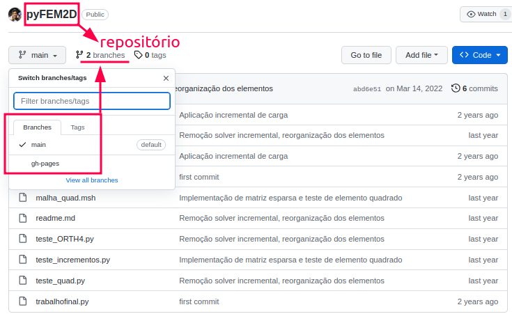
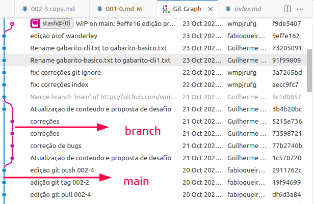

<h1>O que são repositórios e <i>branchs</i></h1>

<p align = "justify">
Um conceito muito importante no âmbito do Git são os repositórios e ramificações (em inglês <i>branchs</i> e nome mais usado). Um repositório, em um contexto geral, é um local onde algo é armazenado, organizado e mantido. O termo pode ser aplicado a diversas áreas, mas é frequentemente usado na área de tecnologia da informação e desenvolvimento de <i>software</i>. 
<br><br>
Já as <i>branchs</i> são caminhos separados de desenvolvimento que permitem que você trabalhe em diferentes recursos, correções de bugs ou melhorias de forma independente, sem interferir no código principal. Cada branch representa uma linha de desenvolvimento separada com sua própria cópia do código-fonte e histórico de alterações.
<br><br>
A <a href = "#fig11">Figura 1.1</a> indica uma busca simples no Google pela palavra chave <b>Repositórios Git de Método dos Elementos Finitos</b>. Nessa busca possível verificar repositórios de usuários que tem como foco a vertente Elementos Finitos.
</p>

<center></center>
<p align = "left" id = "fig11"><b>Figura 1.1</b> Representação dos repositórios no GitHub.</p>

<p align = "justify">
A <a href = "#fig13">Figura 1.3</a> apresenta a localização de uma <i>branch</i> no repositório remoto GitHub. Como dito anteriormente a <i>branch</i> é uma forma de garantir a independência dos desenvolvedores na manipulação do código. A <a href = "#fig14">Figura 1.4</a> apresenta como uma ramificação surge a partir da ramificação <b>master</b> ou <b>main</b>. Neste exemplo são abertas ramificações de correção de <b>bug</b> e uma criação de <b>feature</b>.
</p>

<p align = "left" id = "fig13"><b>Figura 1.3</b> Localização das <i>branchs</i> em um repositório.</p>
<center></center>

<p align = "left" id = "fig14"><b>Figura 1.4</b> Representação de <i>branchs</i> em relação a master.</p>
<center></center>

{: .note }
> bug e feture são denominações comuns em ambientes de desenvolvimento. Bug é normalmente para designar um erro no algoriitmo e normalmente uma _branch_ com esse nome é criada justamente para tratar da solução. Já a _feature_ é o nome dado a uma nova funcionalidade que deseja-se implementar no algoritmo.

<p align = "justify">
A extensão <b>git graph</b> instalada nos ajuda a visualizar essas mudanças na linha do tempo do projeto. Vejamos na <a href = "#fig15">Figura 1.5</a> a representação da criação de uma <i>branch</i> que foi criada no dia 20/10 e finalizada no dia 21/10.
</p>

<p align = "left" id = "fig15"><b>Figura 1.5</b> Linha do tempo das <i>branches</i> do projeto.</p>
<center></center>

{: .note }
> A junção das _branches_ é feita por meio do comando `git merge` que será explicado mais a frente.

<h1>Como funciona a plataforma</h1>

<p align = "justify">
Podemos dizer que o Git irá permitir que você separe o código em quatro espaços distintos e controlados conforme a <a href = "#fig11">Figura 1.1</a>. O usuário navegará entre essas quatro opções até para que um documento "saia" do seu computador e "suba" para o seu 
</p>

<p align = "left" id = "fig11"><b>Figura 1.1</b> Representação dos espaços do Git.</p>
<center></center>

<ol type="1">
    <li><p align = "justify">A seção <i>workspace</i> estará localizado no  nosso próprio computador e será a pasta onde o Git utilizará suas ferramentas de controle.</p></li>
    <li><p align = "justify">A seção <i>staging</i> é aquele espaço destinado aos arquivos que vão para nova versão do código-fonte.</p></li>
    <li><p align = "justify">A seção <i>local repository</i> é o espaço local que estará com todas as modificações prontas para serem repassadas para o repositório remoto.</p></li>
    <li><p align = "justify">A seção <i>remote repository</i> é o repositório remoto final onde ficam as modificações finais impostas pelos desenvolvedores.</p></li>
</ol>

<h1>Configurações gerais Git</h1>

<p align = "justify">
Após fazer o <i>donwload</i> e instalação das aplicações precisamos configurar nosso Git na máquina.
<br><br>
Este passo é fundamental, já que a ferramenta de versionamento, precisa reconhecer a máquina e o autor das alterações que serão posteriormente agregadas ao repositório remoto.
<br><br>
Este passo pode ser feito de duas formas diferentes, sendo uma configuração global, ou seja, valida para qualquer repositório que está na máquina ou de forma individual. Inicialmente vamos configurar apenas duas informações, que já serão suficiente para prosseguirmos com nosso curso.
<br><br>
Vamos aplicar as modificações globais e estas apareceram no historico do Git. Para isso devemos digitar o seguinte comando: 
</p>

{: .note }
> Neste curso utilizaremos como padrão de editável da sintaxe do comando a tag `< >`. Ou sejam tudo que for editável pelo usuário será expreso dentro do símbolo `< >`.

``` bash
$ git config --global user.name <"meu nome">
```
<p>
Feito isso, a segunda informação que precisamos é o email, que é o mesmo criado para a conta do GitHub.
</p>

``` bash
$ git config --global user.email <meu_email@email.com>
```

<p>
Pronto nosso ambiente Git já está configurado e preparado para o uso para verificar as credenciais utilize o comando <code>git config --list</code>.
</p>

{: .highlight }
> Acesse a [documentação](https://git-scm.com/docs/git-config) completa do Git em caso de dúvidas.