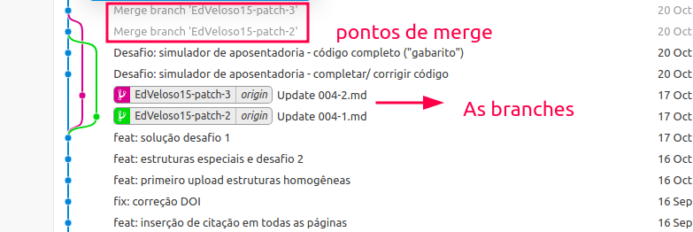

<h1>As branches</h1>

<p align = "justify">
Como dito anteriormente a <i>branch</i> trata-se de uma ramificação do projeto para fins de organização da equipe de trabalho e das implementações.<br><br>
Para visualizar as branchs do projeto execute o comando a seguir:
</p>

<h3 id = "branchs">- Branches</h3>

``` bash
$ git branch
```

{: .note }
> A marcação `*` indicará qual _branch_ você está posicionado quando o output do comando aparecer na interface do terminal.


Exemplo 1
{: .label .label-yellow }

<p align = "justify">
  <i>
  Vamos supor que desejamos listar todas as branches de um repositório remoto. Como poderiamos ver isso?
  </i>
</p>

```shell
$ git branch -a
```

``` cmd
* main
  remotes/origin/HEAD -> origin/main
  remotes/origin/dependabot/bundler/just-the-docs-0.6.2
  remotes/origin/main
```

Exemplo 2
{: .label .label-yellow }

<p align = "justify">
  <i>
  Como eu posso movimentar entre as branches de um projeto?
  </i>
</p>

```shell
$ git checkout <nome da branch>
```

{: .note }
> Isto muda a _branch_ atual para a _branch_ `nome da branch`.

<p align = "justify">
Também é possível criar uma <i>branch</i> com um nome <code>nome da nova branch</code> e altera o ramo atual para ela, isto é, realiza o checkout.
</p>

```shell
$ git checkout -b <nome da nova branch>
```

<h1>Atualizando a master</h1>

<p align = "justify">
Após fazer as operações em uma <i>branch</i> é comum juntar as modificações realizadas de uma determinada <i>branch</i> para a <i>branch</i> <code>master</code>. Para isso é necessário fazer um <code>merge</code>. A <a href = "#fig21">Figura 2.1</a> apresenta o ponto em que as <i>branches</i> foram unificadas a linha do tempo principal.
</p>

<p align = "left" id = "fig21"><b>Figura 2.1</b> Representação do merge das branches.</p>
<center></center>

<p align = "justify">
Para juntar duas <i>branches</i> é necessário estar na <i>branch</i> que deseja-se efetivar as modificações, exemplo: Se eu estou na <i>branch</i> <b>joao</b> e desejo promover modificações na <i>branch</i> <b>main</b> eu preciso exeutar a seguinte sequência.
</p>

```shell
# Fazer todos os commits necessários em joao
$ git checkout main 
$ git branch # verifica se de fato você está na main
$ git merge joao
$ git push origin main
$ git branch -d joao # exclui a branch localmente
$ git push origin --delete joao # exclui a branch remotamente
```

{: .note }
> As sintaxes `git branch -d` e `git push origin --delete` são executadas ao final do `merge` quando a _branch_ não é mais necessário. Logo isso é uma boa prática de manutenção da organização do repositório.

{: .warning }
> Sempre quando for realizar um `merge` verifique se a ramificação receptora e a ramificação que vai ser mesclada estão atualizadas com as alterações remotas mais recentes. Isso requer que você faça um `git pull` nessas ramificações.