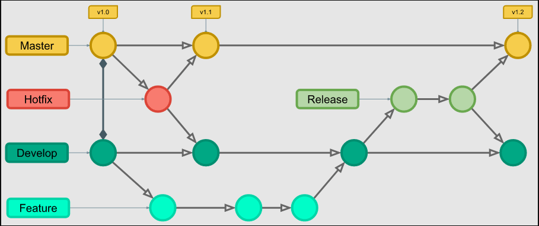

<h1>Git Flow</h1>

Lançado em 2010 pelo engenheiro de software holandês Vincent Driessen, o Git Flow visa aprimorar a organização de branches em repositórios. Isso proporciona maior fluidez no desenvolvimento de novas funcionalidades, correções de bugs e lançamentos de versões.

<h3>Quando Devemos utilizar?</h3>

>O GitFlow é recomendado quando você precisa de uma estrutura organizada para o desenvolvimento de software, especialmente em projetos com lançamentos frequentes, colaboração em equipe extensa e a necessidade de isolar funcionalidades.

 

<h3>Como funciona o Git Flow?</h3>

>O funcionamento do GitFlow baseia-se em duas branches principais: <i><b>master</b></i> para versões estáveis e <i><b>develop</b></i> para integração contínua. As funcionalidades são desenvolvidas em branches específicas a partir da develop.Também são utilizadas duas outras branches, <i><b>feature</b></i> e <i><b>hotfix</b></i>, responsáveis por lançarem novas funcionalidades e corrigir falhas do sistema, respectivamente, conforme imagem mostrada abaixo:

 

 

<h3>Implementação</h3>

>O <i>Git Flow</i> pode ser implementado de duas maneiras diferentes, sendo por meio dos comandos basicos que nós aprendemos no <a href = "https://wmpjrufg.github.io/GIT0001/002-0.html">módulo 2</a>, ou pode ser feito através do  <b><i>CLI do Git Flow</i></b>
